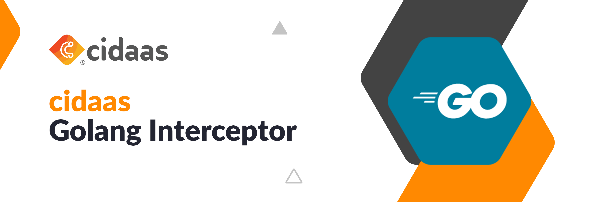

[](https://gitlab.widas.de/cidaas-public-devkits/cidaas-interceptors/cidaas-go-interceptor/-/commits/master)
[](https://gitlab.widas.de/cidaas-public-devkits/cidaas-interceptors/cidaas-go-interceptor/-/commits/master)
[](https://gitlab.widas.de/cidaas-public-devkits/cidaas-interceptors/cidaas-go-interceptor/-/blob/master/LICENSE)



## About cidaas:

[cidaas](https://www.cidaas.com) is a cloud-native Identity & Access Management platform for both **Workforce IAM** and **Customer IAM (CIAM)**. It delivers standards-based Single Sign-On, passwordless authentication, multi-factor authentication, consent management, social/enterprise federation, API security for M2M/IoT, and optional identity verification—built to provide secure, low-friction access at scale.

## About this project: cidaas-go-interceptor

The **cidaas-go-interceptor** is lightweight middleware for protecting Go services with cidaas-issued tokens.

- **Supported frameworks:** `net/http`, `gRPC`, `Fiber`
- **What it does:** validates OIDC/OAuth 2.0 tokens from cidaas and lets you enforce authorization based on scopes/groups/roles with minimal code.

## How to install

### Version 1.x.x

`go get github.com/Cidaas/go-interceptor`

This version allows to secure your APIs by passing **scopes or roles** to the interceptor which can be either validated by introspecting the access token or checking its signature.

### Version 2.x.x

`go get github.com/Cidaas/go-interceptor/v2`

This version allows to secure your APIs by passing **security options** to the interceptor which can be either validated by introspecting the access token or checking its signature. You can pass the following options to the interceptor:

> For the signature validation only the scopes can be validated in a strict way

```go
// SecurityOptions which should be passsed to restrict the api access
type SecurityOptions struct {
	Roles                 []string                 // roles which are allowed to access this api
	Scopes                []string                 // scopes which are allowed to acces this api
	Groups                []GroupValidationOptions // groups which are allowed to acces this api (only possible with introspect, not with signature verification)
	AllowAnonymousSub     bool                     // false (by default) indicates that tokens which have an anonymous sub are rejected, true indicates that tokens which have an ANONYMOUS sub are allowed (only possible with the signature check for now)
	StrictRoleValidation  bool                     // by default false, true indicates that all provided roles must match (only possible with introspect)
	StrictScopeValidation bool                     // by default false, true indicates that all provided scopes must match (also possible with the signature check)
	StrictGroupValidation bool                     // by default false, true indicates that all provided groups must match (only possible with introspect)
	StrictValidation      bool                     // by default false, true indicates that all provided roles, scopes and groups must match (the signature check just checks for the scopes)
}

// GroupValidationOptions provides options to allow API access only to certain groups
// Note: Group validation only works with token introspection, not with signature verification.
// Either GroupID or GroupType should be specified (not both) to define the group criteria.
type GroupValidationOptions struct {
	GroupID              string   `json:"groupId,omitempty"`              // the group id to match (use either GroupID or GroupType)
	GroupType            string   `json:"groupType,omitempty"`            // the group type to match (use either GroupID or GroupType)
	Roles                []string `json:"roles,omitempty"`                // the roles to match
	StrictRoleValidation bool     `json:"strictRoleValidation,omitempty"` // true indicates that all roles must match
	StrictValidation     bool     `json:"strictValidation,omitempty"`     // true indicates that the group id, group type and all roles must match
}
```

#### Breaking changes

* Instead of passing the scopes and roles in order to verify the token, you now need to pass an object with different options, which is explained above
* Now tokens which have **NO SUB** are rejected by default, if you want to allow this you need to enable the SecurityOptions.AllowAnonymousSub flag, which is *false* by default

## Usage

The cidaas go interceptor can be used to secure APIs which use the net/http package, the fiber web framework, or gRPC in golang. 

### gRPC

The gRPC interceptor provides OAuth 2.0 token validation for gRPC services. It supports both signature verification and token introspection methods.

#### Basic Setup

```go
package main

import (
    "net"
    "log"
    
    cidaasinterceptor "github.com/Cidaas/go-interceptor/v2"
    "google.golang.org/grpc"
    "google.golang.org/grpc/reflection"
)

func main() {
    // Initialize CIDAAS interceptor
    cidaasOpts := cidaasinterceptor.Options{
        BaseURI:  "https://your-cidaas-instance.cidaas.de",
        ClientID: "your-client-id", // Optional
        Debug:    false,            // Enable for debugging
    }

    grpcInterceptor, err := cidaasinterceptor.NewGrpcInterceptor(cidaasOpts)
    if err != nil {
        log.Fatal().Err(err).Msg("Failed to initialize CIDAAS gRPC interceptor")
    }

    // Create gRPC server with interceptor
    grpcServer := grpc.NewServer(
        grpc.UnaryInterceptor(grpcInterceptor.VerifyTokenByIntrospect(defaultSecurityOpts)),
    )

    // Register your services
    // yourpb.RegisterYourServiceServer(grpcServer, &YourService{})

    // Enable reflection for debugging
    reflection.Register(grpcServer)

    // Start server
    lis, err := net.Listen("tcp", ":9090")
    if err != nil {
        log.Fatal().Err(err).Msg("Failed to listen")
    }

    log.Info().Msg("Starting gRPC server on :9090")
    if err := grpcServer.Serve(lis); err != nil {
        log.Fatal().Err(err).Msg("Failed to serve gRPC")
    }
}
```

#### Security Options Configuration

```go
// Default security options for basic authentication
defaultSecurityOpts := cidaasinterceptor.SecurityOptions{
    Scopes:                []string{"vault:kms_read", "vault:kms_manage"},
    Roles:                 []string{"admin", "user"},
    StrictScopeValidation: false, // Allow any of the scopes
    StrictRoleValidation:  false, // Allow any of the roles
    AllowAnonymousSub:     false, // Reject anonymous tokens
}

// Strict validation - all scopes and roles must match
strictSecurityOpts := cidaasinterceptor.SecurityOptions{
    Scopes:                []string{"vault:kms_read", "vault:kms_manage"},
    Roles:                 []string{"admin"},
    StrictScopeValidation: true,  // All scopes must be present
    StrictRoleValidation:  true,  // All roles must be present
    AllowAnonymousSub:     false,
}
```

#### Token Validation Methods

**1. Signature Verification (JWT)**

```go
// Verify token by signature (faster, no network calls)
interceptor := grpcInterceptor.VerifyTokenBySignature(cidaasinterceptor.SecurityOptions{
    Scopes:                []string{"vault:kms_read"},
    StrictScopeValidation: true,
    AllowAnonymousSub:     false,
})

grpcServer := grpc.NewServer(grpc.UnaryInterceptor(interceptor))
```

**2. Token Introspection (OAuth 2.0)**

```go
// Verify token by introspection (more secure, validates token status)
// Note: Group validation only works with introspection, not with signature verification
interceptor := grpcInterceptor.VerifyTokenByIntrospect(cidaasinterceptor.SecurityOptions{
	Scopes:                []string{"vault:kms_read", "vault:kms_manage"},
	Roles:                 []string{"admin", "user"},
		Groups:                []cidaasinterceptor.GroupValidationOptions{
			{
				GroupID:   "vault-users", // Use either GroupID or GroupType, not both
				Roles:     []string{"user"},
			},
		},
	StrictScopeValidation: false,
	StrictRoleValidation:  false,
	StrictGroupValidation: false,
})

grpcServer := grpc.NewServer(grpc.UnaryInterceptor(interceptor))
```

#### Accessing Token Data in Service Methods

```go
type VaultService struct {
    pb.UnimplementedVaultServiceServer
}

func (s *VaultService) GetSecret(ctx context.Context, req *pb.GetSecretRequest) (*pb.GetSecretResponse, error) {
    // Get token data from context
    tokenData, ok := cidaasinterceptor.GetTokenDataFromGrpcContext(ctx)
    if !ok {
        return nil, status.Error(codes.Internal, "token data not found in context")
    }

    // Access subject (user ID)
    userID := tokenData.Sub
    
    // Access audience (client ID)
    clientID := tokenData.Aud

    // Your business logic here
    secret, err := s.getSecretForUser(userID, req.SecretId)
    if err != nil {
        return nil, status.Errorf(codes.Internal, "failed to get secret: %v", err)
    }

    return &pb.GetSecretResponse{
        Secret: secret,
    }, nil
}

// Helper functions for common token data access
func (s *VaultService) CreateKey(ctx context.Context, req *pb.CreateKeyRequest) (*pb.CreateKeyResponse, error) {
    // Get subject directly
    userID, ok := cidaasinterceptor.GetSubFromGrpcContext(ctx)
    if !ok {
        return nil, status.Error(codes.Internal, "user ID not found in context")
    }

    // Get audience directly
    clientID, ok := cidaasinterceptor.GetAudFromGrpcContext(ctx)
    if !ok {
        return nil, status.Error(codes.Internal, "client ID not found in context")
    }

    // Your business logic here
    return s.createKeyForUser(userID, req), nil
}
```

#### Client Authentication

Clients must include the Bearer token in the gRPC metadata:

```go
// Client-side code
import (
    "context"
    "google.golang.org/grpc"
    "google.golang.org/grpc/metadata"
)

func callSecureService(client pb.VaultServiceClient, token string) error {
    // Add token to metadata
    md := metadata.New(map[string]string{
        "authorization": "Bearer " + token,
    })
    ctx := metadata.NewOutgoingContext(context.Background(), md)

    // Make authenticated call
    resp, err := client.GetSecret(ctx, &pb.GetSecretRequest{
        SecretId: "my-secret",
    })
    if err != nil {
        return err
    }

    return nil
}
```

#### Error Handling

The interceptor returns appropriate gRPC error codes:

- `codes.Unauthenticated`: Invalid or missing token
- `codes.PermissionDenied`: Token valid but insufficient permissions
- `codes.Internal`: Configuration or network errors

```go
// Handle authentication errors in your service
func (s *VaultService) SecureOperation(ctx context.Context, req *pb.SecureRequest) (*pb.SecureResponse, error) {
    tokenData, ok := cidaasinterceptor.GetTokenDataFromGrpcContext(ctx)
    if !ok {
        return nil, status.Error(codes.Unauthenticated, "authentication required")
    }

    // Check if user has specific permissions
    if !s.hasPermission(tokenData.Sub, "admin") {
        return nil, status.Error(codes.PermissionDenied, "insufficient permissions")
    }

    // Proceed with operation
    return s.performSecureOperation(req), nil
}
```

#### Advanced Configuration

**Per-Endpoint Security Validation:**

The gRPC interceptor supports per-endpoint security validation, allowing you to define different security requirements for each API endpoint.

```go
func main() {
    cidaasOpts := cidaasinterceptor.Options{
        BaseURI:  "https://your-cidaas-instance.cidaas.de",
        ClientID: "your-client-id",
        Debug:    true,
    }

    grpcInterceptor, err := cidaasinterceptor.NewGrpcInterceptor(cidaasOpts)
    if err != nil {
        log.Fatal().Err(err).Msg("Failed to initialize interceptor")
    }

    // Define per-endpoint security requirements
    endpointSecurity := func(fullMethod string) cidaasinterceptor.SecurityOptions {
        switch fullMethod {
        case "/vault.VaultService/Encrypt":
            return cidaasinterceptor.SecurityOptions{
                Scopes:                []string{"vault:kms_manage"},
                StrictScopeValidation: true,
            }
        case "/vault.VaultService/Decrypt":
            return cidaasinterceptor.SecurityOptions{
                Scopes:                []string{"vault:kms_read"},
                StrictScopeValidation: true,
            }
        case "/vault.VaultService/GenerateKey":
            return cidaasinterceptor.SecurityOptions{
                Scopes:                []string{"vault:kms_manage"},
                Groups:                []cidaasinterceptor.GroupValidationOptions{
                    {
                        GroupID:   "key-management",
                        Roles:     []string{"admin", "key_manager"},
                        StrictRoleValidation: false,
                    },
                },
                StrictScopeValidation: true,
                StrictGroupValidation: false,
            }
        case "/vault.VaultService/DeleteKey":
            return cidaasinterceptor.SecurityOptions{
                Scopes:                []string{"vault:kms_manage"},
                Roles:                 []string{"admin"},
                StrictScopeValidation: true,
                StrictRoleValidation:  true, // Must have admin role
            }
        case "/vault.VaultService/Health":
            return cidaasinterceptor.SecurityOptions{
                AllowAnonymousSub: true, // Public endpoint
            }
        default:
            // Default security for unknown endpoints
            return cidaasinterceptor.SecurityOptions{
                Scopes:                []string{"vault:kms_read"},
                StrictScopeValidation: false,
            }
        }
    }

    // Create gRPC server with per-endpoint validation
    grpcServer := grpc.NewServer(
        grpc.UnaryInterceptor(
            grpcInterceptor.VerifyTokenByIntrospectWithEndpointValidation(endpointSecurity),
        ),
    )

    // Register services
    // pb.RegisterVaultServiceServer(grpcServer, &VaultService{})
}
```

**Multiple Interceptors with Different Security Levels:**

```go
func main() {
    cidaasOpts := cidaasinterceptor.Options{
        BaseURI:  "https://your-cidaas-instance.cidaas.de",
        ClientID: "your-client-id",
        Debug:    true,
    }

    grpcInterceptor, err := cidaasinterceptor.NewGrpcInterceptor(cidaasOpts)
    if err != nil {
        log.Fatal().Err(err).Msg("Failed to initialize interceptor")
    }

    // Create interceptors for different security levels
    adminInterceptor := grpcInterceptor.VerifyTokenByIntrospect(cidaasinterceptor.SecurityOptions{
        Roles:                []string{"admin"},
        StrictRoleValidation: true,
    })

    userInterceptor := grpcInterceptor.VerifyTokenByIntrospect(cidaasinterceptor.SecurityOptions{
        Scopes:                []string{"vault:read", "vault:write"},
        StrictScopeValidation: false,
    })

    // Use different interceptors for different services
    adminServer := grpc.NewServer(grpc.UnaryInterceptor(adminInterceptor))
    userServer := grpc.NewServer(grpc.UnaryInterceptor(userInterceptor))

    // Register services
    // pb.RegisterAdminServiceServer(adminServer, &AdminService{})
    // pb.RegisterUserServiceServer(userServer, &UserService{})
}
```

**Debug Mode:**

```go
cidaasOpts := cidaasinterceptor.Options{
    BaseURI:  "https://your-cidaas-instance.cidaas.de",
    ClientID: "your-client-id",
    Debug:    true, // Enable debug logging
}
```

When debug mode is enabled, the interceptor logs:
- Token scopes and roles
- Validation decisions
- Introspection requests and responses
- JWKS key retrieval

### net/http
The following examples will show how to use the interceptor if you are using the net/http package for your APIs.

**Attached an example how to secure an API with scopes and roles based on the signature of a token:**

#### Version 1.x.x

```go
func get(w http.ResponseWriter, r *http.Request) {
	// set response to ok and return Status ok and response
	w.Header().Set("Content-Type", "application/json")
	w.WriteHeader(http.StatusOK)
	w.Write([]byte(respJSON))
	return
}

func main() {
	r := mux.NewRouter()
	api := r.PathPrefix("/api/v1").Subrouter()
	// Base URI is mandatory, ClientID is optional, if ClientID is set the interceptor will only allow requests from this Client
	cidaasInterceptor, err := cidaasinterceptor.New(cidaasinterceptor.Options{BaseURI: "https://base.cidaas.de", ClientID: "clientID"})
	if err != nil {
		log.Panicf("Initialization of cidaas interceptor failed! Error: %v", err)
		panic("Panic!")
	}
	getHandler := http.HandlerFunc(get)
	api.Handle("/", cidaasInterceptor.VerifyTokenBySignature(getHandler, []string{"profile", "cidaas:api_scope"}, []string{"role:Admin"})).Methods(http.MethodGet)
	log.Fatal(http.ListenAndServe(":8080", r))
}
```

#### Version 2.x.x

```go
func get(w http.ResponseWriter, r *http.Request) {
	// set response to ok and return Status ok and response
	w.Header().Set("Content-Type", "application/json")
	w.WriteHeader(http.StatusOK)
	w.Write([]byte(respJSON))
	return
}

func main() {
	r := mux.NewRouter()
	api := r.PathPrefix("/api/v2").Subrouter()
	// Base URI is mandatory, ClientID is optional, if ClientID is set the interceptor will only allow requests from this Client
	cidaasInterceptor, err := cidaasinterceptor.New(cidaasinterceptor.Options{BaseURI: "https://base.cidaas.de", ClientID: "clientID"})
	if err != nil {
		log.Panicf("Initialization of cidaas interceptor failed! Error: %v", err)
		panic("Panic!")
	}
	getHandler := http.HandlerFunc(get)
	api.Handle("/", cidaasInterceptor.VerifyTokenBySignature(getHandler, cidaasinterceptor.SecurityOptions{
		Scopes: []string{"your scope"},
		Roles: []string{"role:Admin"},
	})).Methods(http.MethodGet)
	api.Handle("/user", cidaasInterceptor.VerifyTokenBySignature(getHandler, cidaasinterceptor.SecurityOptions{
		AllowAnonymousSub: true, // add this flag if you want to allow tokens with an anonymous sub
		Scopes: []string{"your scope"},
		Roles: []string{"role:Admin"},
	})).Methods(http.MethodGet)
	log.Fatal(http.ListenAndServe(":8080", r))
}
```

**Attached an example how to secure an API with scopes and roles based on an introspect call to the cidaas instance:**

#### Version 1.x.x

```go
func get(w http.ResponseWriter, r *http.Request) {
	// set response to ok and return Status ok and response
	w.Header().Set("Content-Type", "application/json")
	w.WriteHeader(http.StatusOK)
	w.Write([]byte(respJSON))
	return
}

func main() {
	r := mux.NewRouter()
	api := r.PathPrefix("/api/v1").Subrouter()
	// Base URI is mandatory, ClientID is optional, if ClientID is set the interceptor will only allow requests from this Client
	cidaasInterceptor, err := cidaasinterceptor.New(cidaasinterceptor.Options{BaseURI: "https://base.cidaas.de", ClientID: "clientID"})
	if err != nil {
		log.Panicf("Initialization of cidaas interceptor failed! Error: %v", err)
		panic("Panic!")
	}
	getHandler := http.HandlerFunc(get)
	api.Handle("", cidaasInterceptor.VerifyTokenByIntrospect(getHandler, []string{"profile", "cidaas:api_scope"}, nil)).Methods(http.MethodGet)
	log.Fatal(http.ListenAndServe(":8080", r))
}
```

#### Version 2.x.x

```go
func get(w http.ResponseWriter, r *http.Request) {
    ...
	// set response to ok and return Status ok and response
	w.Header().Set("Content-Type", "application/json")
	w.WriteHeader(http.StatusOK)
	w.Write([]byte(respJSON))
	return
}

func main() {
	r := mux.NewRouter()
	api := r.PathPrefix("/api/v1").Subrouter()
	// Base URI is mandatory, ClientID is optional, if ClientID is set the interceptor will only allow requests from this Client
	cidaasInterceptor, err := cidaasinterceptor.New(cidaasinterceptor.Options{BaseURI: "https://base.cidaas.de", ClientID: "clientID"})
	if err != nil {
		log.Panicf("Initialization of cidaas interceptor failed! Error: %v", err)
		panic("Panic!")
	}
	getHandler := http.HandlerFunc(get)
	api.Handle("", cidaasInterceptor.VerifyTokenByIntrospect(getHandler, cidaasinterceptor.SecurityOptions{
		Scopes: []string{"your scope"},
		Roles: []string{"role:Admin"},
	})).Methods(http.MethodGet)
	log.Fatal(http.ListenAndServe(":8080", r))
}
```

**Attached an example how to secure an API with groups based on an introspect call to the cidaas instance:**

> **Note:** Group validation only works with token introspection, not with signature verification. This is because group information is not available in JWT tokens and requires a call to the cidaas introspection endpoint.

#### Version 1.x.x

> Not supported

#### Version 2.x.x

```go
func get(w http.ResponseWriter, r *http.Request) {
    ...
	// set response to ok and return Status ok and response
	w.Header().Set("Content-Type", "application/json")
	w.WriteHeader(http.StatusOK)
	w.Write([]byte(respJSON))
	return
}

func main() {
	r := mux.NewRouter()
	api := r.PathPrefix("/api/v1").Subrouter()
	// Base URI is mandatory, ClientID is optional, if ClientID is set the interceptor will only allow requests from this Client
	cidaasInterceptor, err := cidaasinterceptor.New(cidaasinterceptor.Options{BaseURI: "https://base.cidaas.de", ClientID: "clientID"})
	if err != nil {
		log.Panicf("Initialization of cidaas interceptor failed! Error: %v", err)
		panic("Panic!")
	}
	getHandler := http.HandlerFunc(get)
	api.Handle("", cidaasInterceptor.VerifyTokenByIntrospect(getHandler, cidaasinterceptor.SecurityOptions{
		Groups: []cidaasinterceptor.GroupValidationOptions{
			{GroupID: "yourGroupID", GroupType: "department"},
		},
	})).Methods(http.MethodGet)
	api.Handle("/user", cidaasInterceptor.VerifyTokenByIntrospect(getHandler, cidaasinterceptor.SecurityOptions{
		AllowAnonymousSub: true, // add this flag if you want to allow tokens with an anonymous sub
		Groups: []cidaasinterceptor.GroupValidationOptions{{GroupID: "yourGroupID"}},
	})).Methods(http.MethodGet)
	log.Fatal(http.ListenAndServe(":8080", r))
}
```

### [Fiber](https://github.com/gofiber/fiber)
The following examples will show how to use the interceptor if you are using the fiber web framework for your APIs.

#### How to install

```
go get -u github.com/gofiber/fiber/v2
```

**Attached an example how to secure an API with scopes and roles based on the signature token validation and also with the introspect call:**

#### Version 1.x.x

```go
func CreateApp() (*fiber.App, error) {
	interceptor, err := cidaasinterceptor.NewFiberInterceptor(cidaasinterceptor.Options{
		BaseURI:  BaseUrl,
		ClientID: Client_id,
	})
	if err != nil {
		ls.Fatal().Err(err).Msg("can't initialize interceptor")
	}
	app := fiber.New()
	root := app.Group(fmt.Sprintf("/%s", base.ServiceName))
	root.Post("/user", interceptor.VerifyTokenBySignature([]string{"profile", "cidaas:api_scope"}, []string{"role:Admin"}), handler.UserHandler)
	root.Post("/user", interceptor.VerifyTokenByIntrospect([]string{"profile", "cidaas:api_scope"}, []string{"role:Admin"}), handler.UserHandler)
	return app, nil
}

func main()  {
    app, err := CreateApp()
	if err != nil {
		panic(err)
    }
	app.Listen(":3000")
}
```

#### Version 2.x.x

```go
func CreateApp() (*fiber.App, error) {
	interceptor, err := cidaasinterceptor.NewFiberInterceptor(cidaasinterceptor.Options{
		BaseURI:  BaseUrl,
		ClientID: Client_id,
	})
	if err != nil {
		ls.Fatal().Err(err).Msg("can't initialize interceptor")
	}
	app := fiber.New()
	root := app.Group(fmt.Sprintf("/%s", base.ServiceName))
	root.Post("/user", interceptor.VerifyTokenBySignature(cidaasinterceptor.SecurityOptions{
		Scopes: []string{"your scope"},
		Roles: []string{"role:Admin"},
	}), handler.UserHandler)
	root.Post("/groups", interceptor.VerifyTokenBySignature(cidaasinterceptor.SecurityOptions{
		AllowAnonymousSub: true, // add this flag if you want to allow tokens with an anonymous sub
		Scopes: []string{"your scope"},
		Roles: []string{"role:Admin"},
	}), handler.UserHandler)
	root.Post("/user", interceptor.VerifyTokenByIntrospect(cidaasinterceptor.SecurityOptions{
		Scopes: []string{"your scope"},
		Roles: []string{"role:Admin"},
	}), handler.UserHandler)
	return app, nil
}

func main()  {
    app, err := CreateApp()
	if err != nil {
		panic(err)
    }
	app.Listen(":3000")
}
```


**Attached an example how to secure an API with groups with the introspect call:**

#### Version 1.x.x

> Not supported

#### Version 2.x.x

```go
func CreateApp() (*fiber.App, error) {
	interceptor, err := cidaasinterceptor.NewFiberInterceptor(cidaasinterceptor.Options{
		BaseURI:  BaseUrl,
		ClientID: Client_id,
	})
	if err != nil {
		ls.Fatal().Err(err).Msg("can't initialize interceptor")
	}
	app := fiber.New()
	root := app.Group(fmt.Sprintf("/%s", base.ServiceName))
	root.Post("/user", interceptor.VerifyTokenByIntrospect(cidaasinterceptor.SecurityOptions{
		Groups: []cidaasinterceptor.GroupValidationOptions{{GroupID: "yourGroupID"}},
	}), handler.UserHandler)
	return app, nil
}

func main()  {
    app, err := CreateApp()
	if err != nil {
		panic(err)
    }
	app.Listen(":3000")
}
```